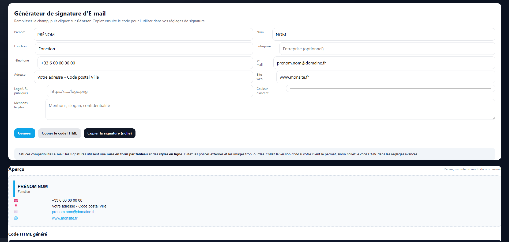

# SignMailMaker

## Introduction

Il s'agit d'un générateur de signature de fin de mail. Vous pouvez y indiquer de nombreuses informations concernant une entreprise dans les champs dédiés, une fois les champs renseignés, vous pouvez cliquez sur le bouton "générer".C'est un outil idéal pour la mise en forme d'un mail professionel.  
Vous pouvez copier le visuel complet de la signature en appuyant sur copier la signature (riche) ou l'avoir en version html avec le bouton copier le code HTML.

## Installation 

Pour installer le projet vous devez taper, dans git bash, **git init + l'Url du projet.**
Pour avoir un visuel, vous pouvez installer l'extension Live Server de Ritwick Dey, dans Visual Studio Code. 

Local : 
docker build -t maracorp-signature:dev .
docker run --rm -p 8081:80 maracorp-signature:dev 

# http://localhost:8081

